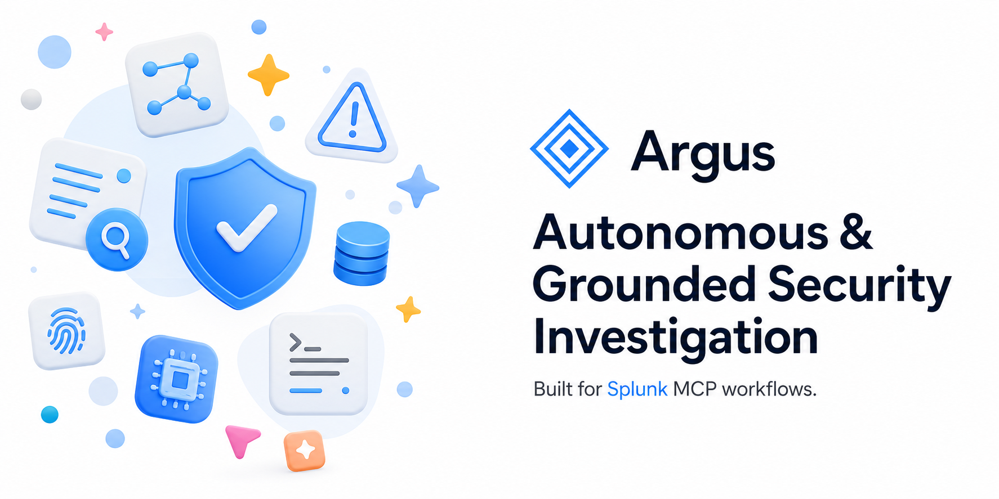
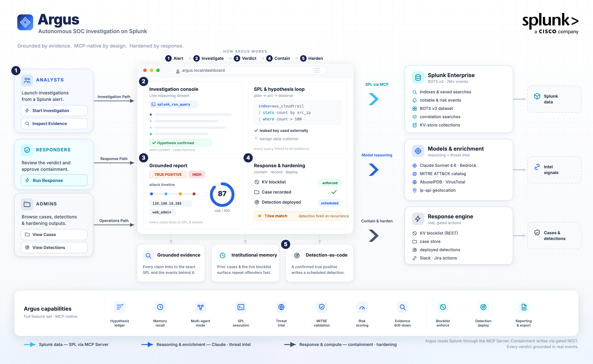

# Argus — Autonomous SOC Investigation Agent

> An AI agent that autonomously investigates security alerts end-to-end on the
> Splunk platform — planning, running its own SPL through the **Splunk MCP Server**,
> pivoting across real data, enriching indicators with live threat intel, mapping to
> MITRE ATT&CK, reaching a **grounded** verdict, and **executing real containment**.
> Every conclusion links to the exact SPL it ran and the exact events it saw.

Built for the **Splunk Agentic Ops Hackathon** — Security track.

---

## Live

- 🎥 **Demo video** — https://youtu.be/1id6YQgY73s
- 🌐 **Live app** — https://www.tryargus.xyz
- 📖 **Docs** — https://www.tryargus.xyz/docs
- 🗺️ **Architecture** — https://www.tryargus.xyz/architecture

---

## Table of Contents

- [Quick Path](#quick-path)
- [Why It Stands Out](#why-it-stands-out)
- [What it does](#what-it-does)
- [Architecture](#architecture)
- [Requirements](#requirements)
- [Setup](#setup)
- [Usage](#usage)
- [Argus as an MCP server](#argus-as-an-mcp-server)
  - [Use Argus from Claude Code](#use-argus-from-claude-code-or-any-mcp-host)
  - [Hosted demo endpoint (for judges)](#hosted-demo-endpoint-for-judges)
- [Project layout](#project-layout)
- [License](#license)

---

## Quick Path

If you want the shortest path through the project:

```bash
cp .env.example .env
uv sync
uv run argus check
uv run argus investigate "Investigate suspicious AWS activity in botsv3"
uv run argus detections --run --earliest 0
```

For the web UI:

```bash
uv run argus serve --port 8010
cd web
npm install
npm run dev
```

Then open `http://127.0.0.1:3000/dashboard`.

For the Splunk-native demo path:

- Saved search -> custom alert action -> Argus webhook: [`docs/SPLUNK_ALERT_ACTION.md`](docs/SPLUNK_ALERT_ACTION.md)
- Detection dry-run + on-demand proof: [`docs/DETECTION_PROOF.md`](docs/DETECTION_PROOF.md)
- Submission narrative: [`submission.md`](submission.md)

## Why It Stands Out

Argus is strong for the Security track and the Splunk MCP bonus story because it
does three things together:

- **It investigates autonomously through Splunk MCP.** Argus writes its own SPL
  through the Splunk MCP Server instead of following a fixed query tree.
- **It is reusable, not just a demo app.** Argus can sit behind a packaged
  Splunk custom alert action, and it can also expose its own MCP tools for
  other SOC copilots or analyst applications.
- **It leaves the SOC better than it found it.** After a confirmed true
  positive, Argus can contain the threat and install the detection that catches
  the recurrence.

## What it does

- **Autonomous investigation** — a real plan → act → observe → re-plan loop. Claude
  dynamically writes SPL, runs it via the MCP server, reads the results, and decides
  the next query. No hardcoded query paths.
- **Explicit hypothesis ledger** — the agent declares its leading theories up front and
  marks each **confirmed/refuted** as evidence lands, so the reasoning is auditable and
  it tests alternatives instead of confirming the first guess.
- **Institutional memory** — before and during every investigation Argus recalls its own
  past cases and active blocklist (`recall_memory`): a repeat-offender indicator surfaces
  its prior verdict instantly, the way a veteran analyst would remember it.
- **Grounded incident report** — verdict, severity, confidence, attack timeline,
  affected entities, IOCs, and recommended actions — each timeline step linked to the
  `tool_use` query that evidences it.
- **Validated MITRE ATT&CK + kill-chain** — every technique id is checked against a
  pinned, real ATT&CK Enterprise catalog (v19.1, 858 techniques); hallucinated ids are
  dropped, and the incident's tactics render as an ordered kill-chain.
- **Composite risk score (0–100)** — a defensible, explainable score from verdict,
  confidence, severity, kill-chain breadth, live threat-intel, and case-memory history —
  for real triage/prioritization, not just a severity label.
- **Multi-agent mode** (`--multi`) — four specialists (auth, network, endpoint,
  threat-intel) investigate concurrently and a synthesizer correlates them into one
  attack narrative.
- **Real threat-intel enrichment** — IP/domain/hash reputation via ip-api (no key),
  AbuseIPDB and VirusTotal (if keys provided).
- **Real containment** (`--respond`) — writes offending indicators to a Splunk
  KV-store blocklist that a **correlation search enforces against live data**, records
  a case, and (if configured) opens Slack/Jira tickets — with a human-approval gate
  (or `--auto`).
- **Self-hardening loop (detection-as-code)** — after a confirmed true positive Argus
  writes a new read-only SPL **detection** for the attack pattern and **installs it as a
  real scheduled Splunk correlation search**, so the SOC auto-alerts if it recurs. Argus
  doesn't just close the incident — it leaves behind the detection that catches the next one.
- **Evaluation harness** (`argus eval`) — runs Argus against 6 curated BOTS v3 scenarios
  (4 real attacks: AWS IAM credential abuse, endpoint malware, S3 public exposure,
  cryptojacking; + 2 benign precision controls) and measures verdict accuracy, indicator
  recall, **grounding precision** (every reported IOC verified to exist in the data), and
  **ATT&CK validity** (invalid technique ids — should be zero). `--repeat K` multi-samples
  each scenario and reports a verdict **pass-rate** (a single run is one noisy draw). Every
  ground-truth indicator is curated from the data as verified-malicious, not just present.
- **Live token-by-token streaming** of the agent's reasoning.
- **Provider-agnostic** — runs on the **Anthropic API** or **AWS Bedrock**.
- **Reusable SOC MCP server** — Argus can also run as its own MCP server
  (`argus mcp`), exposing high-level tools like `argus_investigate_alert`,
  `argus_recall_memory`, and gated response execution so existing SOC copilots
  and MCP hosts can plug it in directly. Argus consumes the Splunk MCP Server
  and publishes an analyst-grade MCP interface on top.

## Architecture



In short: a CLI/agent → a Claude-powered (single- or multi-agent) orchestrator →
the **Splunk MCP Server** (the only way it reads Splunk) → Splunk Enterprise with
the BOTS v3 dataset. Real containment is written to KV-store collections (via the
authenticated REST API) in the companion `argus_response` app and enforced by a
correlation search.

**Explore it live:**

- 🌐 Live app — https://www.tryargus.xyz
- 🗺️ Interactive architecture — https://www.tryargus.xyz/architecture
- 📖 Docs — https://www.tryargus.xyz/docs
- 🎥 Demo video — https://youtu.be/1id6YQgY73s

## Requirements

- macOS / Linux, [`uv`](https://docs.astral.sh/uv/)
- Splunk Enterprise 9.x/10.x + the **Splunk MCP Server** app (Splunkbase 7931)
- The **BOTS v3** dataset (free, pre-indexed)
- An LLM provider: an Anthropic API key, **or** an AWS Bedrock API key + model access

## Setup

### 1. Splunk + MCP Server + data
```bash
# Install Splunk Enterprise (download from splunk.com), then:
$SPLUNK_HOME/bin/splunk start --accept-license --answer-yes --no-prompt --seed-passwd '<pw>'

# Install the MCP Server app (Splunkbase app 7931), then allow plaintext tokens locally:
$SPLUNK_HOME/bin/splunk install app splunk-mcp-server_*.tgz -auth admin:'<pw>'
printf '[server]\nrequire_encrypted_token = false\n' \
  > $SPLUNK_HOME/etc/apps/Splunk_MCP_Server/local/mcp.conf

# Load BOTS v3 (pre-indexed; no license impact):
curl -L -o botsv3.tgz https://botsdataset.s3.amazonaws.com/botsv3/botsv3_data_set.tgz
tar -xzf botsv3.tgz -C $SPLUNK_HOME/etc/apps/

# Install the Argus response app (this repo):
cp -R splunk/argus_response $SPLUNK_HOME/etc/apps/
$SPLUNK_HOME/bin/splunk restart
```

The companion app also includes a custom alert action, **Investigate with Argus**,
and a disabled demo saved search wired to it. With `uv run argus serve` running,
Splunk can send a saved-search alert directly into Argus, which investigates it
through the Splunk MCP Server and records a case back in Splunk. See
[`docs/SPLUNK_ALERT_ACTION.md`](docs/SPLUNK_ALERT_ACTION.md).

Argus-authored detections are dry-run through the Splunk MCP Server before they
are saved, and can be executed on demand for proof of efficacy. See
[`docs/DETECTION_PROOF.md`](docs/DETECTION_PROOF.md).

### 2. A Splunk token (audience MUST be `mcp`)
```bash
curl -sk -u admin:'<pw>' -X POST \
  https://localhost:8089/services/admin/token-auth/tokens_auth -d disabled=false
curl -sk -u admin:'<pw>' -X POST https://localhost:8089/services/authorization/tokens \
  --data-urlencode name=admin --data-urlencode audience=mcp -d output_mode=json
```

### 3. Configure and install Argus
```bash
cp .env.example .env     # set SPLUNK_TOKEN + provider creds (see below)
uv sync
uv run argus check       # lists the MCP tools — confirms the whole chain is live
```

### Provider configuration (.env)
- **Anthropic:** `ARGUS_PROVIDER=anthropic`, `ANTHROPIC_API_KEY=…`
- **AWS Bedrock:** `ARGUS_PROVIDER=bedrock`, `AWS_BEARER_TOKEN_BEDROCK=…`, `AWS_REGION=us-west-2`
- `ARGUS_MODEL=claude-sonnet-4-6` (default)

## Usage

```bash
# Sanity checks
uv run argus check
uv run argus query 'search index=botsv3 | stats count' --earliest 0

# Single-agent investigation (live streaming reasoning + SPL)
uv run argus investigate "Investigate suspicious AWS activity in botsv3"

# Multi-agent specialist team
uv run argus investigate "Investigate the Frothly AWS compromise" --multi

# Investigate AND contain (human-approval gate; add --auto to skip prompts)
uv run argus investigate "Investigate AWS credential abuse" --respond

# Evaluate accuracy on BOTS scenarios
uv run argus eval

# Prove Argus-authored detections execute and match live Splunk data
uv run argus detections --run --earliest 0

# Expose Argus itself as an MCP server (stdio by default)
uv run argus mcp

# Optional HTTP transports for MCP clients that support them
uv run argus mcp --transport streamable-http --host 127.0.0.1 --port 8765
```

## Argus as an MCP server

Argus is both an MCP client and an MCP server:

```text
MCP host / SOC copilot
  -> Argus MCP tools
  -> Argus autonomous investigator
  -> Splunk MCP Server
  -> Splunk Enterprise
```

Available Argus MCP tools:

- `argus_health` — configuration and Splunk MCP reachability.
- `argus_investigate_alert` — runs a full grounded investigation and returns the
  report plus evidence metadata.
- `argus_recall_memory` — searches Argus case memory and blocklist.
- `argus_list_cases`, `argus_list_blocklist`, `argus_list_detections` — expose
  the SOC memory and self-hardening artifacts.
- `argus_execute_response` — executes response actions from a completed report.
  This tool requires the exact confirmation string `EXECUTE_ARGUS_RESPONSE`
  because it can write to Splunk KV store and deploy detections.

### Use Argus from Claude Code (or any MCP host)

Argus speaks MCP over **stdio**, so you can run autonomous SOC investigations
without leaving Claude Code, Claude Desktop, Cursor, or any MCP host — it brings
the whole Splunk investigation loop into your existing workflow.

**Claude Code** — add it once (point `--directory` at your Argus checkout so it
loads `.env` with your Splunk token + provider creds):

```bash
claude mcp add argus -- uv run --directory /path/to/argus argus mcp
```

Then just ask, in plain language:

```text
> use argus to investigate suspicious AWS activity in botsv3
> ask argus to recall what it knows about 45.131.66.13
> have argus run its deployed detections over the last 24h
```

**Claude Desktop / Cursor / other hosts** — add Argus to the MCP servers config:

```json
{
  "mcpServers": {
    "argus": {
      "command": "uv",
      "args": ["run", "--directory", "/path/to/argus", "argus", "mcp"]
    }
  }
}
```

The host now has Argus's tools (above): `argus_investigate_alert` runs a full
grounded investigation through the Splunk MCP Server and returns the report +
evidence; reads like `argus_recall_memory` / `argus_list_cases` /
`argus_run_detections` are safe to call freely; `argus_execute_response` stays
gated behind the `EXECUTE_ARGUS_RESPONSE` confirmation string.

### Hosted demo endpoint (for judges)

A **read-only** Argus MCP server is hosted so you can try it with **zero setup** —
no clone, no `uv`, no Splunk, no credentials. It runs against a live Splunk
Enterprise + BOTS v3 and exposes only the read / investigate / proof tools;
response execution is not registered at all.

```bash
claude mcp add argus-hosted --transport http https://mcp.tryargus.xyz/mcp \
  --header "Authorization: Bearer <token-in-submission-notes>"
```

Then ask Claude to `use argus-hosted to investigate suspicious AWS activity in botsv3`.
The bearer token is in the submission notes; the endpoint is token-gated and cannot
run containment.

## Project layout

```
src/argus/
  mcp_client.py   # async JSON-RPC client for the Splunk MCP Server
  agent.py        # single-agent + multi-agent loops, hypothesis ledger, response phase
  connectors.py   # ResponseEngine: blocklist/cases, recall, enforcement, detection-as-code, Slack/Jira
  enrich.py       # deterministic post-processing: MITRE validation + risk score + memory + kill-chain
  mitre.py        # pinned MITRE ATT&CK Enterprise catalog (technique validation)
  threatintel.py  # real IP/domain/hash reputation enrichment
  llm.py          # provider-agnostic client (Anthropic API or AWS Bedrock via boto3)
  models.py       # the structured incident report
  prompts.py      # investigator / specialist / synthesis / response prompts
  eval.py         # evaluation harness (verdict / recall / grounding precision / ATT&CK validity)
  mcp_server.py   # Argus-as-MCP tools for external SOC copilots / MCP hosts
  cli.py          # check | query | tool | investigate | cases | detections | monitor | serve | mcp | eval
data/mitre/techniques.json   # pinned ATT&CK v19.1 catalog (committed, reproducible)
splunk/argus_response/       # companion Splunk app (KV collections + correlation search)
```

## License

MIT — see [`LICENSE`](LICENSE).
